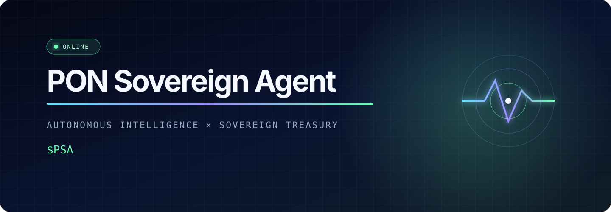

<p align="center">
  
</p>

<p align="center">
  <a href="https://github.com/OWNER/pon-sovereign-agent/actions"></a>
  
  
  
  <a href="LICENSE"></a>
</p>

> **PON Sovereign Agent is an autonomous AI treasury that continuously evolves its intelligence and allocates protocol-generated revenue across crypto and tokenized real-world assets.**

`$PSA` is the coordination layer around that mandate: observe markets, price risk, propose an allocation, enforce constitutional limits, record the decision, learn from the outcome, repeat.

```console
$ npm run --silent psa -- status
┌──────────────────────────────────────────────────────────┐
│  PON Sovereign Agent                                $PSA  │
│  CA：0x762952aae34acd9bf4b3055b0e11948a50ee1799
└──────────────────────────────────────────────────────────┘

NETWORK      simulation
EXECUTION    LOCKED / DRY-RUN ONLY
MODEL        psa-intelligence/0.1.0
TREASURY     $1,000,000
NEW REVENUE  $35,000
```

## The mandate

Most protocol treasuries are passive: revenue arrives, accumulates in one asset, and waits for a governance vote. PSA turns that idle balance into a continuously managed, protocol-owned portfolio.

The agent has one narrow objective:

```text
maximize durable protocol-owned capital
subject to liquidity, concentration, drawdown, confidence, and governance constraints
```

That distinction matters. PSA is not an unconstrained trading bot and it does not control user deposits. It manages a defined revenue treasury inside a policy envelope that the intelligence layer cannot rewrite.

## Why sovereign

Sovereignty is an architectural property, not a slogan.

| Principle | PSA boundary |
|---|---|
| Revenue-native | Allocates protocol-generated revenue, not user custody by default |
| Policy-bound | Reserve, exposure, turnover, and drawdown limits are deterministic |
| Model-agnostic | Intelligence providers can change without changing treasury policy |
| Fail-closed | Low confidence, invalid data, or excessive drawdown halts risk-taking |
| Verifiable | Every proposal carries inputs, rationale, policy checks, and a decision ID |
| Evolvable | Outcome feedback improves calibration; policy authority stays separate |

## The sovereign loop

```text
                       verified outcome
                              │
                              ▼
┌──────────┐   ┌──────────┐   ┌───────────┐   ┌────────────┐
│ observe  ├──►│ evaluate ├──►│ deliberate├──►│ constrain  │
│ markets  │   │ risk     │   │ allocation│   │ guardrails │
└──────────┘   └──────────┘   └───────────┘   └─────┬──────┘
      ▲                                              │
      │            ┌──────────┐   ┌──────────┐       │
      └────────────┤ learn    │◄──┤ attest   │◄──────┘
                   │ safely   │   │ outcome  │   execute¹
                   └──────────┘   └──────────┘

¹ Execution is intentionally locked in this research release.
```

The intelligence may recommend. The policy engine decides whether the recommendation is admissible. The execution adapter—when audited and explicitly enabled—may only carry out an admissible decision.

## Start in 30 seconds

The research core has **zero runtime dependencies**. Node.js provides native TypeScript execution.

```bash
# clone after replacing OWNER with the GitHub account or organization
git clone https://github.com/OWNER/pon-sovereign-agent.git
cd pon-sovereign-agent

# verify the locked dependency graph (currently empty)
npm ci

# inspect the agent
npm run --silent psa -- status
npm run --silent psa -- thesis
npm run --silent psa -- policy

# ask for a policy-checked allocation
npm run --silent psa -- rebalance

# run the evolving intelligence loop
npm run --silent psa -- simulate --cycles 12 --seed 42

# prove the deterministic boundaries still hold
npm test
```

No API key, wallet, RPC, or funded account is required for simulation.

## Interrogate the agent from your terminal

### Read the machine state

```bash
npm run --silent psa -- status
npm run --silent psa -- policy --json
npm run --silent psa -- rebalance --json
```

Pipe decisions into the tools you already use:

```bash
# current regime and confidence
npm run --silent psa -- rebalance --json \
  | jq '{id, regime: .risk.regime, confidence: .risk.confidenceBps}'

# proposed portfolio only
npm run --silent psa -- rebalance --json \
  | jq '.allocation.targetWeights'

# every guardrail result
npm run --silent psa -- rebalance --json \
  | jq -r '.guardrails.checks[] | [.name, .passed, .observed, .limit] | @tsv'

# fail a shell pipeline if the proposal is quarantined
npm run --silent psa -- rebalance --json \
  | jq -e '.guardrails.passed == true' >/dev/null
```

### Stress the learning loop

```bash
# deterministic baseline
npm run --silent psa -- simulate --cycles 24 --seed 42

# alternative market path
npm run --silent psa -- simulate --cycles 24 --seed 9001

# capture a complete machine-readable run
npm run --silent psa -- simulate --cycles 100 --seed 7 --json > /tmp/psa-run.json

# inspect model evolution across the run
jq -r '.[].learning.modelVersion' /tmp/psa-run.json | uniq -c

# inspect every circuit-breaker cycle
jq '.[] | select(.decision.risk.regime == "HALTED")' /tmp/psa-run.json
```

### Confirm that execution fails closed

```bash
$ npm run --silent psa -- rebalance --execute
psa: Execution is locked: install and audit an execution adapter first.
```

This is intentional. The repository demonstrates intelligence and control logic; it does not pretend that a simulation is a production treasury.

## Capital universe

The default fixture models four economic roles. Symbols are illustrative inputs, not endorsements or claims of a live integration.

| Sleeve | Fixture | Purpose | Primary risk |
|---|---|---|---|
| Reserve | `USDC` | Liquidity floor and defensive destination | Issuer / depeg |
| Liquid crypto | `ETH` | Protocol-aligned liquid beta | Volatility |
| Yield crypto | `stETH` | Productive crypto exposure | Smart contract / liquidity |
| Tokenized rates | `USTB` | Short-duration RWA yield | Issuer / redemption / legal |
| Tokenized commodity | `XAUT` | Non-sovereign real-asset hedge | Custody / liquidity |

The adapter boundary is designed for the universe to expand without giving a model permission to invent assets. An asset must be allowlisted, observable, capacity-scored, and governed before it becomes allocatable.

## Policy is the constitution

The default policy lives in [`psa.config.json`](psa.config.json):

```json
{
  "reserveFloorBps": 2000,
  "maxRwaBps": 5000,
  "maxCryptoBps": 4500,
  "maxAssetBps": 3500,
  "maxTurnoverBps": 2500,
  "minConfidenceBps": 6500,
  "circuitBreakerBps": 1200
}
```

In plain language:

- Keep at least 20% in the reserve asset.
- Never place more than 35% in one non-reserve asset.
- Cap tokenized RWA exposure at 50% and crypto exposure at 45%.
- Limit normal one-way turnover to 25% per decision cycle.
- Halt risk-taking when confidence falls below 65%.
- Move to the reserve target when drawdown reaches 12%.

Try a separate policy without editing source code:

```bash
cp psa.config.json /tmp/psa-defensive.json

jq '.policy.reserveFloorBps = 4000
  | .policy.maxCryptoBps = 2500
  | .policy.maxTurnoverBps = 1000' \
  psa.config.json > /tmp/psa-defensive.json

PSA_CONFIG=/tmp/psa-defensive.json \
  npm run --silent psa -- rebalance
```

See [Treasury Policy](docs/TREASURY_POLICY.md) for invariants, emergency precedence, and the path from JSON research policy to governed on-chain policy.

## Intelligence that can evolve—without becoming sovereign

The prototype maintains a small, explicit learning state:

```text
model version + observation count + calibration error + exploration budget
```

After each simulated cycle, PSA compares predicted stress with realized stress. It updates its calibration error and gradually reduces exploration. Every five verified observations produces a new patch version. This is intentionally legible: the repository demonstrates the feedback contract before adding opaque models.

```bash
npm run --silent psa -- simulate --cycles 6 --seed 42

# ...
# 5  CALM  93.26%  $3,208  20.00%  35.00%  45.00%  psa-intelligence/0.1.1
```

What may evolve:

- risk calibration;
- signal weighting;
- forecast selection;
- allocation utility inside permitted bounds;
- evidence quality and decision explanations.

What may not evolve autonomously:

- custody permissions;
- asset allowlists;
- reserve floors or exposure caps;
- signer thresholds;
- circuit breakers;
- the definition of protocol-owned revenue.

The deeper model is described in [Intelligence](docs/INTELLIGENCE.md).

## Repository map

```text
.
├── adapters/                Data, policy, and execution adapter registry
├── assets/                  GitHub-native visual identity
├── benchmarks/              Safety acceptance thresholds
├── config/                  Non-secret environment profiles
├── contracts/               Future on-chain execution interfaces
├── deployments/             Authoritative deployment manifests
├── docs/                    Architecture, intelligence, policy, token, roadmap
├── examples/                Consumer-ready decision envelopes
├── governance/              PON Improvement Proposal workflow
├── integrations/            External capability and permission matrix
├── operations/              Incident response and operating runbooks
├── schemas/                 Versioned policy and decision JSON Schemas
├── scenarios/               Reproducible calm and emergency conditions
├── scripts/                 Repository validation and catalog tooling
├── src/                     Risk, allocation, learning, simulation, and CLI
├── tests/                   Native Node policy and determinism tests
├── psa.config.json          Human-readable treasury constitution
└── package.json             Zero-runtime-dependency command surface
```

## Development

```bash
# runtime requirements
node --version                 # >= v22.6.0
npm --version

# install exactly what the lockfile declares
npm ci

# run all tests
npm test

# test + CLI syntax check
npm run check

# validate all required folders and JSON artifacts
npm run validate:repo

# inspect adapters, integrations, and deployment status
npm run catalog

# run the CLI directly
node --experimental-strip-types src/cli.ts help

# verify JSON output remains parseable
npm run --silent psa -- rebalance --json | jq empty

# inspect changed files before committing
git status --short
git diff --check
git diff --stat
```

The tests assert portfolio conservation, reserve floors, exposure caps, turnover limits, circuit-breaker behavior, deterministic simulation, and learning-version updates. Repository validation also checks all 16 public directories, every JSON artifact, policy consistency, and example allocation totals.

## Architecture at a glance

```text
UNTRUSTED / PROBABILISTIC                 TRUSTED / DETERMINISTIC

market feeds ──┐
RWA evidence ──┼─► observation ─► intelligence ─► proposal.json
model output ──┘                                      │
                                                     ▼
                                          ┌────────────────────┐
governed policy.json ─────────────────────►│ policy validator   │
allowlisted adapters ─────────────────────►│ + circuit breaker  │
                                          └─────────┬──────────┘
                                                    │ admissible only
                                                    ▼
                                             execution adapter
                                                    │
                                                    ▼
                                           receipt + outcome
```

Production is expected to split these responsibilities across separately permissioned services and governed contracts. Read [Architecture](docs/ARCHITECTURE.md) before building an adapter.

## `$PSA`

`$PSA` is proposed as a coordination primitive for the system—not a promise of yield, a claim on an undisclosed treasury, or evidence that a token is currently deployed.

Candidate utility includes policy governance, curator bonding, evaluator rewards, and treasury-alignment signaling. Supply, distribution, legal structure, voting design, and any value-accrual mechanism are deliberately **unspecified** until they can be documented and reviewed. See [Token Design](docs/TOKEN.md).

## Road to autonomy

```console
[x] v0.1  deterministic simulation + policy-checked decisions
[ ] v0.2  signed evidence bundles + replayable decision ledger
[ ] v0.3  read-only chain and market adapters
[ ] v0.4  shadow treasury on public testnet
[ ] v0.5  audited, capped execution with timelocked governance
[ ] v1.0  progressively decentralized policy and evaluator network
```

Milestones are capability gates, not date promises. Full acceptance criteria live in [Roadmap](docs/ROADMAP.md).

## Publish your fork

If this folder has not been connected to GitHub yet:

```bash
git init -b main
git add .
git commit -m "feat: introduce PON Sovereign Agent"

# GitHub CLI: creates the repository, sets origin, and pushes main
gh repo create pon-sovereign-agent \
  --public \
  --source=. \
  --remote=origin \
  --push

# confirm the remote and first CI run
git remote -v
gh run list --limit 5
```

After publishing, replace `OWNER` in the clone URL and CI badge with the GitHub account or organization.

## Security and status

This repository is a **research preview**. It does not contain production execution adapters, deployed contracts, a live treasury, or an issued token. Never add a funded signer key to `.env`; `.env` files are ignored, but local plaintext keys are still unsafe.

Report vulnerabilities privately using GitHub's private vulnerability reporting flow. Read [SECURITY.md](SECURITY.md) before testing against any live system.

## Contributing

Contributions are welcome where they improve safety, reproducibility, market adapters, risk evaluation, or decision transparency. Start with [CONTRIBUTING.md](CONTRIBUTING.md), run `npm run check`, and keep new behavior covered by deterministic tests.

## License

MIT © 2026 PON Sovereign Agent contributors. See [LICENSE](LICENSE).

---

<p align="center"><strong>Intelligence compounds. Treasury compounds. Sovereignty remains.</strong></p>
